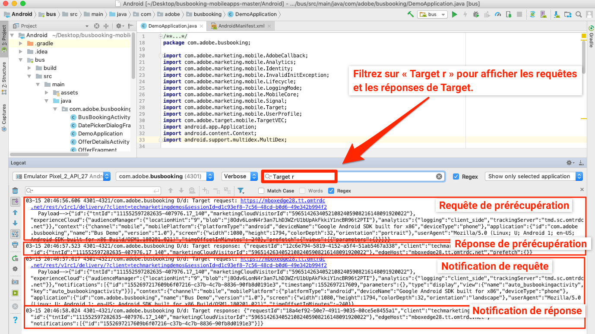
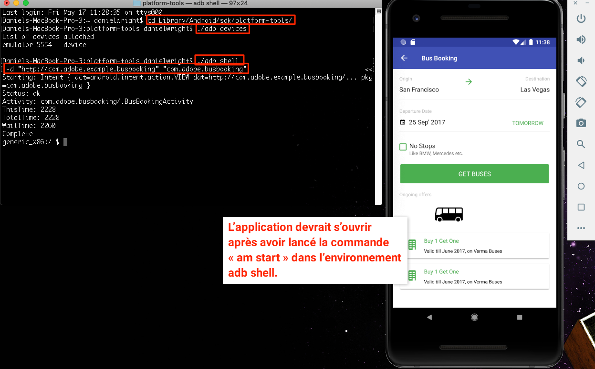
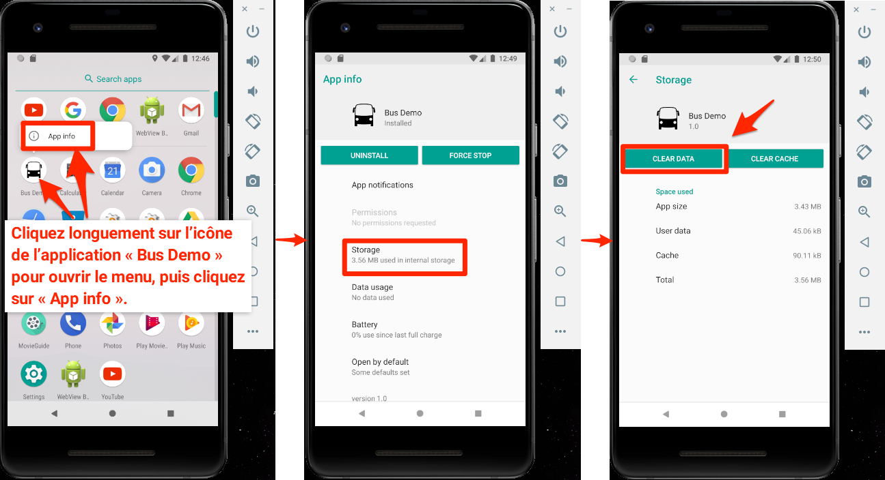

# Ajout du compositeur d’expérience visuelle (VEC) d’Adobe Target

Dans cette leçon, vous allez activer le compositeur d’expérience visuelle (VEC) Target pour les applications mobiles.

[Adobe Target](https://docs.adobe.com/content/help/fr-FR/target/using/target-home.html) est la solution d’Adobe Experience Cloud qui fournit tout ce dont vous avez besoin pour personnaliser l’expérience de vos clients afin de maximiser les recettes de vos sites web et mobiles, de vos applications, de vos médias sociaux et d’autres canaux numériques.

Le VEC pour applications mobiles natives permet de créer des activités et de personnaliser du contenu sur les applications mobiles natives, à votre propre manière, sans dépendances de développement continu et de cycles de commercialisation d’application.

Dans la leçon [Ajout d’extensions](launch-add-extensions.md), vous avez ajouté l’extension Target VEC à votre propriété Launch. Dans la leçon [Installation du SDK Mobile](launch-install-the-mobile-sdk.md), vous avez importé l’extension dans l’exemple d’application. Seules quelques mises à jour mineures sont requises pour démarrer la configuration des activités dans le compositeur d’expérience visuelle mobile de Target.

>[!IMPORTANT] Les extensions Target VEC pour Launch et Target sont requises afin d’utiliser le VEC de Target dans votre application mobile.

## Objectifs d’apprentissage

À la fin de cette leçon, vous saurez comment :

* activer l’exemple d’application pour le VEC de Target ;
* ajouter des paramètres à la requête du VEC de Target ;
* associer votre appareil au VEC ;
* créer une activité à l’aide du VEC.

## Conditions préalables

Pour pouvoir suivre les leçons de cette section, vous devez :

* avoir suivi les leçons de la section [Configuration de Launch](launch-create-a-property.md) ;
* disposer d’un accès de niveau approbateur à l’interface d’Adobe Target.

## La requête de chargement d’application

Target déclenchera une requête de « chargement d’application » lors du premier chargement de l’application en raison des paramètres sélectionnés lors de la configuration de l’extension Target VEC. Cette requête prérécupère toutes les activités du VEC de Target que vous avez créées pour votre application.

Dans Android Studio, filtrez Logcat sur « Target r » pour afficher les requêtes et réponses de Target. Notez les paramètres du nom et de la version de l’application. Toutes les activités du VEC de Target que vous créez sont automatiquement envoyées vers ces propriétés.



## Ajout de paramètres

Comme vous l’avez vu dans le dernier exercice, les mesures de cycle de vie de l’application sont automatiquement incluses en tant que paramètres dans la requête du VEC de Target. Vous pouvez également ajouter des paramètres personnalisés aux requêtes, de manière globale ou pour des affichages spécifiques de l’application.

**Ajout de paramètres personnalisés de manière globale**

1. Dans Android Studio, ouvrez le fichier `DemoApplication`
1. Importez l’extension Target VEC en ajoutant `import ACPTargetVEC` sous l’importation existante
1. Ajoutez l’exemple de code suivant dans la fonction `onCreate()` avant l’enregistrement des extensions. Cet exemple de code montre comment ajouter des paramètres normaux, des paramètres de profil, des paramètres de produit (ou d’entité) et des paramètres de commande à la requête TargetVEC. Cet exemple utilise des valeurs statiques, alors qu’il vaut mieux utiliser des variables dynamiques pour renseigner ces valeurs dans votre véritable application. Bien entendu, il n’est nécessaire de renseigner que les paramètres pertinents pour tous les affichages :

   ```java
   Map<String, String>targetParams = new HashMap<>(); //params
   targetParams.put( "param1", "value1");
   Map<String, String>taregtProfileParams = new HashMap<>(); //profile params
   taregtProfileParams.put("profilekey1","profilevalue1");
   
   TargetVEC.setGlobalRequestParameters(new TargetParameters.Builder()
            .parameters(targetParams)
            .profileParameters(taregtProfileParams)
            .product(new TargetProduct("1234", "furniture"))
            .order(new TargetOrder("12343", 123.45, Arrays.asList("100", "200")))
            .build());
   ```

1. Il peut y avoir des erreurs dans Android Studio, puisque le code de paramètre ci-dessus nécessite les importations suivantes, que vous devez ajouter au fichier :

   ```java
   import com.adobe.marketing.mobile.TargetOrder;
   import com.adobe.marketing.mobile.TargetProduct;
   import com.adobe.marketing.mobile.TargetParameters;
   import java.util.Arrays;
   import java.util.Map;
   import java.util.HashMap;
   ```

   

Maintenant que vous avez ajouté des paramètres à l’application, il est temps de confirmer qu’ils sont transmis dans la requête.

**Vérification des paramètres**

1. Enregistrez le projet Android Studio
1. Recréez l’application et attendez qu’elle s’ouvre à nouveau dans l’émulateur
1. Ouvrez le volet Logcat d’Android Studio
1. Filtrez pour afficher toutes les instructions avec « Target r »
1. Les paramètres personnalisés que vous venez d’ajouter doivent être visibles dans la requête

   

Pour plus d’informations et de détails sur la manière de transmettre des paramètres avec des affichages spécifiques, consultez [la documentation](https://docs.adobe.com/content/help/fr-FR/target/using/implement-target/mobile-apps/composer/mobile-visual-experience-composer-android.html#parameters).

## Association de l’application mobile à l’interface de Target

Pour créer des activités VEC dans l’interface de Target, vous devez d’abord associer Target à votre application. Cette association est réalisée grâce à l’utilisation de liens profonds.

### Création du lien profond

Android prend en charge l’utilisation de [liens profonds et de liens d’application Android](https://developer.android.com/training/app-links/deep-linking) pour créer des URL permettant d’accéder directement à des emplacements spécifiques de votre application. Vous les utilisez probablement déjà dans votre application. Si c’est le cas, vous pouvez utiliser votre structure d’URL existante pour les associer à Target. Dans ce tutoriel, vous passerez en revue le lien profond prédéfini dans l’application Bus Booking, vérifierez qu’il fonctionne et l’utiliserez pour associer votre application au VEC de Target pour les applications mobiles.

**Consultation de la configuration du lien profond**

1. Dans Android Studio, ouvrez le fichier AndroidManifest.xml
1. Notez qu’un filtre intent est déjà configuré pour le modèle de lien profond de l’application Bus Booking
1. Notez que les attributs `Host` et `Scheme` sont déjà définis sur `com.adobe.example.busbooking` et `http`, respectivement. Cela signifie qu’en cas d’ouverture dans l’émulateur, une URL comme `http://com.adobe.example.busbooking` devrait automatiquement ouvrir l’exemple d’application

   

L’étape suivante consiste à confirmer que le modèle de lien profond fonctionne

### Vérification du lien profond

Il faut maintenant s’assurer que le lien profond ouvrira l’application dans l’émulateur. Vous pouvez utiliser la méthode d’exécution des commandes adb de votre choix.

**Vérification du lien profond à l’aide d’adb (Mac®)**

1. Vérifiez que l’émulateur Android est en cours d’exécution
1. Fermez l’application Bus Booking si elle est ouverte
1. Ouvrez une fenêtre de terminal
1. Accédez au répertoire des outils de la plateforme Android : `cd Library/Android/sdk/platform-tools/`
1. Vérifiez que votre émulateur est joint : `./adb devices`
1. Ouvrez l’adb shell : `./adb shell`
1. Dans l’adb shell, testez le lien profond : `am start -W -a android.intent.action.VIEW -d "http://com.adobe.example.busbooking" "com.adobe.busbooking"`
1. Vérifiez que l’application Bus Booking s’est lancée dans l’émulateur

   

Maintenant que votre structure de lien profond est mise en place, vous pouvez utiliser le VEC de Target pour configurer des activités.

## Création d’une activité dans le VEC mobile

Créons maintenant une activité dans l’interface de Target.

**Création d’une activité avec le VEC de Target**

1. Connectez-vous à [Adobe Experience Cloud](https://experiencecloud.adobe.com)
1. Accédez à Target à partir du sélecteur de solution.

   

1. Lancez Target.

   

1. Cliquez sur le bouton **[!UICONTROL Créer une activité]** et sélectionnez **[!UICONTROL Test A/B]**.
1. Sélectionnez **[!UICONTROL Application mobile]**
1. Vérifiez que **[!UICONTROL Visuel]** est sélectionné sous **[!UICONTROL Choisir le compositeur d’expérience]**
1. Cliquez sur le bouton **[!UICONTROL Suivant]**

   

1. Sur l’écran **[!UICONTROL Sélectionner une application à utiliser]**, cliquez sur **[!UICONTROL Ajouter une nouvelle application]**

   

1. Saisissez le schéma d’URL que vous venez de définir dans le champ **[!UICONTROL Saisir le schéma d’URL]**, par exemple `http://com.adobe.example.busbooking/`
1. Cliquez sur **[!UICONTROL Créer le lien profond]**

   

   >[!NOTE] Vous disposez de quelques options d’envoi du lien profond vers l’application. Vous pouvez :
   >
   >   1. envoyer le lien profond à une adresse électronique valide, puis l’ouvrir avec une application de messagerie sur l’appareil ;
   >   1. prendre une photo du code QR de votre appareil Android (dans notre tutoriel, l’appareil doit être lié à Android Studio) ;
   >   1. copier le lien profond de l’interface de Target et l’envoyer à l’appareil de la manière de votre choix.


1. Cliquez sur l’onglet **[!UICONTROL Copier et envoyer le lien]**
1. Cliquez sur l’URL générée (lorsque vous cliquez sur l’URL, celle-ci est automatiquement copiée dans le presse-papiers)

   

1. Ouvrez une fenêtre de terminal (ou revenez dans la fenêtre si elle est encore ouverte)
1. Accédez au répertoire des outils de la plateforme Android (il est possible que vous y soyez déjà) : `cd Library/Android/sdk/platform-tools/`
1. Vérifiez que votre émulateur est joint : `./adb devices`
1. Ouvrez l’adb shell : `./adb shell`
1. Dans l’adb shell, remplacez [YOUR_TARGET_URL_WITH_TOKEN] dans la commande suivante par l’URL que vous venez de copier dans le presse-papiers : `am start -W -a android.intent.action.VIEW -d "[YOUR_TARGET_URL_WITH_TOKEN]" "com.adobe.busbooking"`
1. Une fois l’application chargée, revenez à l’onglet du navigateur dans lequel Target est ouvert. Votre application devrait être chargée dans le VEC
1. En cliquant sur des ressources de texte et d’image dans votre application, vous devriez avoir accès à des options pour les modifier et les remplacer.

   

   > [!TIP] Si le Mobile VEC ne s’ouvre pas automatiquement dans l’interface de Target lors de l’ouverture du lien profond dans l’appareil mobile, essayez d’effectuer les manipulations suivantes :
   >
   >   1. Vérifiez que vous utilisez exactement la même URL dans l’interface de Target et que vous n’avez supprimé aucun caractère accidentellement. Lors de l’exécution de la commande dans l’adb shell, vérifiez que l’URL est entre guillemets
      >
      >
      >   

   1. Vérifiez que vous avez ajouté au fichier build.gradle les dépendances supplémentaires requises par le VEC de Target. Ces dépendances doivent avoir été ajoutées lors de la leçon [Installation du SDK Mobile](https://docs.adobe.com/content/help/fr-FR/experience-cloud/implementing-in-mobile-android-apps-with-launch/configure-launch/launch-install-the-mobile-sdk.html#update-the-buildgradle-file)
      >
      >
      >   

   1. Essayez d’effacer les données stockées dans l’application, comme indiqué dans l’illustration ci-dessous
      >
      >       
      


1. Apportez quelques modifications au premier écran de votre application
1. Positionnez maintenant l’émulateur à côté du navigateur en gardant le VEC ouvert
1. Accédez à un autre écran de l’application et observez comment le VEC se met à jour avec l’émulateur
1. Au sein d’une même activité, vous pouvez mettre à jour plusieurs affichages dans votre application

   

1. Vous pouvez aussi ajouter à vue des mesures de suivi des clics
1. Enregistrez et approuvez votre activité, puis assurez-vous de pouvoir l’afficher dans l’exemple d’application

L’association de l’appareil au VEC est une action unique. Lorsque vous créerez d’autres activités sur le même appareil, vous n’aurez qu’à sélectionner l’appareil dans une liste, comme illustré ci-dessous :


>[!TIP] Si un appareil est ouvert, mais « indisponible » dans le menu de sélection, essayez de fermer et d’ouvrir à nouveau l’application sur l’émulateur ou l’appareil.

## Création d’audiences en fonction de mesures de cycle de vie

Les mesures de cycle de vie sont des mesures intégrées concernant l’utilisation de votre application par le visiteur. Elles sont automatiquement incluses dans les appels effectués par le SDK Adobe Mobile. Vous pouvez facilement créer des audiences dans Target en fonction de ces mesures.

**Création d’une audience**

1. Dans l’interface de Target, cliquez sur **Audiences** dans le volet de navigation supérieur
1. Cliquez sur le bouton **Créer une audience**

   

1. Donnez un nom à l’audience `Launches < 5`
1. Cliquez sur **Ajouter une règle &gt; Personnaliser**.

   

1. Dans la première liste déroulante, sélectionnez le paramètre **a.Launches**. Tous les paramètres des mesures de cycle de vie commencent par le préfixe « a. ». Nous allons cibler le contenu en fonction du nombre de lancements d’application dont dispose l’utilisateur, ce qui constitue un excellent moyen de cibler les nouveaux utilisateurs de votre application avec une première expérience utilisateur (FTUE) instructive.
1. Dans la liste déroulante suivante, sélectionnez **est inférieur à**
1. Dans la troisième liste déroulante, saisissez **5**
1. Cliquez sur **Enregistrer**

   

Notez qu’il existe une grande variété d’options prêtes à l’emploi pour la création d’audiences dans Target. De plus, vous pouvez envoyer des données personnalisées dans la requête Target pour la création d’audiences, utiliser des audiences partagées à partir d’autres solutions Experience Cloud, telles qu’Audience Manager et Analytics, ainsi que des données de gestion de la relation client partagées avec Target à l’aide de la fonction Attributs du client du service principal People.

[Suite : « Ajout d’Adobe Target » &gt;](target.md)