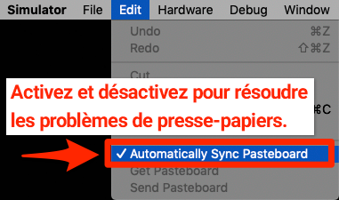
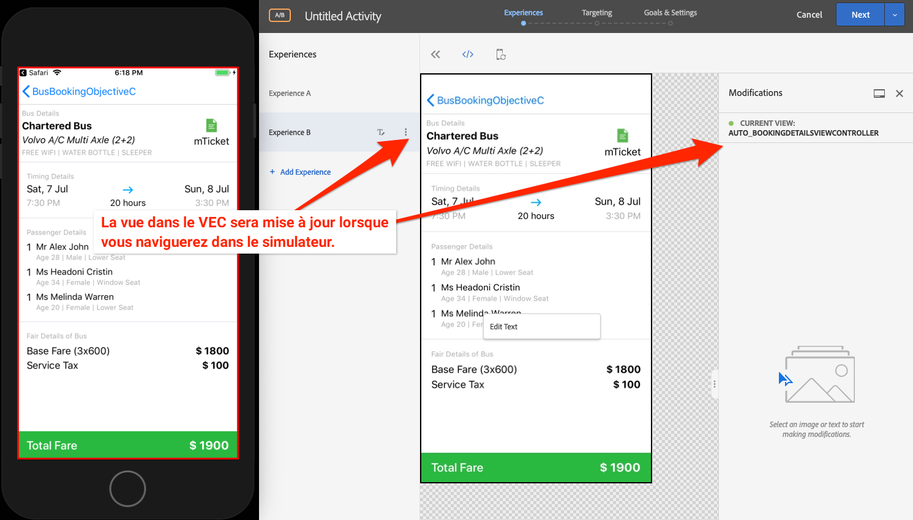

# Ajout du compositeur d’expérience visuelle (VEC) d’Adobe Target

Dans cette leçon, vous allez activer le compositeur d’expérience visuelle (VEC) Target pour les applications mobiles.

[Adobe Target](https://docs.adobe.com/content/help/fr-FR/target/using/target-home.html) est la solution d’Adobe Experience Cloud qui fournit tout ce dont vous avez besoin pour personnaliser l’expérience de vos clients afin de maximiser les recettes de vos sites web et mobiles, de vos applications, de vos médias sociaux et d’autres canaux numériques.

Le compositeur d’expérience visuelle (VEC) pour applications mobiles natives vous permet de créer des activités et de personnaliser du contenu sur les applications mobiles natives à votre propre manière sans dépendances de développement continu et de cycles de commercialisation d’application.

Dans la leçon [Ajout d’extensions](launch-add-extensions.md), vous avez ajouté l’extension Target VEC à votre propriété Launch. Dans la leçon [Installation du SDK Mobile](launch-install-the-mobile-sdk.md), vous avez importé l’extension dans l’exemple d’application. Seules quelques mises à jour mineures sont requises pour démarrer la configuration des activités dans le compositeur d’expérience visuelle mobile de Target.

>[!WARNING] Les extensions Target VEC pour Launch et Target sont requises afin d’utiliser le VEC de Target dans votre application mobile.

## Objectifs d’apprentissage

À la fin de cette leçon, vous saurez comment :

* activer l’exemple d’application pour le VEC de Target ;
* ajouter des paramètres à la requête du VEC de Target ;
* associer votre appareil au VEC ;
* créer une activité à l’aide du VEC.

## Conditions préalables

Pour pouvoir suivre les leçons de cette section, vous devez :

* avoir suivi les leçons de la section [Configuration de Launch](launch-create-a-property.md) ;
* disposer d’un accès de niveau Approbateur à l’interface d’Adobe Target.

## Ajout de paramètres

Les mesures de cycle de vie sont automatiquement incluses en tant que paramètres dans la requête du VEC de Target. Vous pouvez également ajouter des paramètres personnalisés aux requêtes.

**Ajout de paramètres personnalisés**

1. Dans Xcode, ouvrez le fichier `BookingViewController.m`. Ce fichier est utilisé par l’écran d’accueil.
1. Importez les extensions Target VEC et Target sous les importations existantes.

   ```swift
   #import "ACPTarget.h"
   #import "ACPTargetVEC.h"
   ```

1. Dans la fonction `viewDidLoad`, après la ligne contenant `super.viewDidLoad`, ajoutez le code suivant. Cet exemple de code montre comment ajouter des paramètres, des paramètres de profil, des paramètres de produit (ou d’entité) et des paramètres de commande à la requête TargetVEC. Cet exemple utilise des valeurs statiques, tandis que dans votre application, vous souhaitez utiliser des variables dynamiques pour renseigner ces valeurs. Et bien sûr, vous ne souhaitez renseigner que les paramètres relatifs à l’affichage :

   ```objective-c
   NSDictionary *params = @{@"param1":@"value1"};
   NSDictionary *profileParams = @{@"profilekey1":@"profilevalue1"};
   ACPTargetProduct *product = [ACPTargetProduct targetProductWithId:@"1234" categoryId:@"furniture"];
   ACPTargetOrder *order = [ACPTargetOrder targetOrderWithId:@"12343" total:@(123.45) purchasedProductIds:@[@"100",@"200"]];
   ACPTargetParameters *targetParams = [ACPTargetParameters targetParametersWithParameters:params
                                                                         profileParameters:profileParams
                                                                                   product:product
                                                                                     order:order];
   [ACPTargetVEC setGlobalRequestParameters:targetParams];
   ```

   

Maintenant que vous avez ajouté des paramètres à l’application, il est temps de confirmer qu’ils sont transmis dans la requête.

**Vérification des paramètres**

1. Enregistrez le projet Xcode.
1. Recréez l’application et attendez qu’elle soit rouverte dans le simulateur.
1. Cliquez sur le volet Console de Xcode.
1. Utilisez ⌘-F pour ouvrir le champ de recherche.
1. Recherchez `targetvec` dans le champ de recherche.
1. Appuyez sur `Enter` pour accéder à la requête Target et au corps de publication. Recherchez les paramètres personnalisés que vous venez d’ajouter à la requête :

   

## Association de l’application mobile à l’interface de Target

Pour créer des activités VEC dans l’interface de Target, vous devez d’abord associer Target à votre application. Cette association est réalisée grâce à l’utilisation de liens profonds.

### Création du schéma de lien profond

iOS prend en charge l’utilisation de [liens universels](https://developer.apple.com/documentation/uikit/core_app/allowing_apps_and_websites_to_link_to_your_content) et de [schémas d’URL personnalisés](https://developer.apple.com/documentation/uikit/core_app/allowing_apps_and_websites_to_link_to_your_content/defining_a_custom_url_scheme_for_your_app) pour créer des liens profonds vers votre application. Vous utilisez probablement déjà des schémas d’URL personnalisés dans votre application. Si tel est le cas, vous pouvez utiliser ces liens existants pour établir une association avec Target. Pour ce tutoriel, vous devez créer un schéma d’URL personnalisé.

**Enregistrement de votre schéma d’URL**

1. Dans Xcode, double-cliquez sur votre application pour ouvrir l’écran Paramètres.
1. Dans l’écran Paramètres, cliquez sur l’onglet `Info`.
1. Développez la section `URL Types`.
1. Notez que l’**[!UICONTROL identifiant]** est défini sur `com.adobetarget.BusBookingObjectiveC`. Vous pouvez utiliser cet identifiant ou le modifier si vous le souhaitez.
1. Notez que l’**[!UICONTROL schéma d’URL]** est `BusBookingObjectiveC`. Vous pouvez utiliser ce schéma ou le modifier si vous le souhaitez.
1. Assurez-vous que l’**[!UICONTROL éditeur]** est sélectionné comme **[!UICONTROL rôle]**.

   

1. Si vous avez mis à jour l’identifiant ou le schéma, cliquez sur l’onglet `General` pour enregistrer le schéma.  Cliquez à nouveau sur l’onglet `Info`, développez la section `URL type` et vérifiez que votre identifiant ou votre schéma est enregistré.

L’étape suivante consiste à ajouter un gestionnaire pour le lien profond.

**Gestion des liens profonds**

1. Ouvrez le fichier `AppDelegate.m`.
1. Ajoutez la ligne `[ACPCore collectLaunchInfo:@ {@"adb_deeplink": url.absoluteString}];` à la section `AppDelegate:application:openURL` comme illustré ci-dessous.
   

### Vérification du lien profond

Désormais, lorsqu’un utilisateur qui a installé votre application ouvre une URL du type `BusBookingObjectiveC://com.adobetarget.BusBookingObjectiveC` (ou tout schéma que vous avez défini) dans le simulateur, votre application s’ouvrira.

**Vérification du schéma de lien profond**

1. Enregistrez le projet Xcode.
1. Recréez l’application.
1. Dans le simulateur, ouvrez Safari.
1. Entrez l’URL `BusBookingObjectiveC://com.adobetarget.BusBookingObjectiveC` (ou le schéma que vous avez défini) dans la barre d’adresse. Si vous rencontrez des difficultés, consultez la section Conseil ci-dessous.
1. Avec un modal, vous devriez être invité à effectuer l’action « Ouvrir cette page dans BusBookingObjectiveC ». Si vous rencontrez des difficultés, consultez la section Conseil ci-dessous.
1. Cliquez sur `Open`.
1. L’application Bus Booking devrait s’ouvrir.

   > [!TIP] Si vous ne réussissez pas à copier-coller l’URL de votre bureau vers le simulateur, c’est généralement pour l’une des deux raisons suivantes :
   >
   >   1. **L’URL copiée à partir de l’interface de Target ne se colle pas dans le simulateur**. Cela se produit lorsque le presse-papiers du bureau et celui du simulateur ne sont pas synchronisés.  Dans ce cas, essayez de désactiver et d’activer le paramètre `Automatically Sync Pasteboard` dans le simulateur et copiez-collez à nouveau :
      >
      >      
      
      >
      >   
   1. **Le collage de l’URL renvoie sur la page de résultats de Google Search**. Essayez de recoller l’URL du lien profond dans la barre d’adresse, puis appuyez sur `Enter`. Vous devrez peut-être répéter cette opération plusieurs fois.


   

Maintenant que votre structure de lien profond est mise en place, vous pouvez utiliser le VEC de Target pour configurer des activités.

## Création d’une activité dans le VEC mobile

Créons maintenant une activité dans l’interface utilisateur de Target.

**Création d’une activité avec le VEC de Target**

1. Connectez-vous à [Adobe Experience Cloud](https://experiencecloud.adobe.com)
1. Accédez à Target à partir du sélecteur de solution.

   

1. Lancez Target.

   

1. Cliquez sur le bouton **[!UICONTROL Créer une activité]** et sélectionnez **[!UICONTROL Test A/B]**.
1. Sélectionnez **[!UICONTROL Application mobile]**.
1. Assurez-vous que **[!UICONTROL Visuelle]** est sélectionné sous **[!UICONTROL Sélectionner un compositeur d’expérience]**.
1. Cliquez sur le bouton **[!UICONTROL Suivant]**.

   

1. Sur l’écran **[!UICONTROL Sélectionner une application à utiliser]**, cliquez sur **[!UICONTROL Ajouter une nouvelle application]**.

   

1. Saisissez le schéma d’URL que vous venez de définir dans le champ **[!UICONTROL Saisir le schéma d’URL]**, par ex. `BusBookingObjectiveC://com.adobetarget.BusBookingObjectiveC`.
1. Cliquez sur **[!UICONTROL Créer un lien profond]**.

   

   >[!NOTE] Vous disposez de plusieurs options pour envoyer le lien profond vers l’application. Vous pouvez :
   >
   >   1. prendre une photo du code QR de votre appareil iOS (dans notre tutoriel, l’appareil doit être lié à Xcode) ;
   >   1. copier le lien profond de l’interface de Target et l’envoyer à l’appareil comme vous le souhaitez ;
   >   1. envoyer le lien profond à une adresse électronique valide, puis l’ouvrir avec une application de messagerie sur l’appareil ;


1. Cliquez sur l’onglet **[!UICONTROL Copier et envoyer le lien]**
1. Cliquez n’importe où sur le lien pour le copier automatiquement dans le presse-papiers.

   

1. Revenez au simulateur.
1. Ouvrez Safari dans le simulateur.
1. Collez l’URL du lien profond dans la barre d’adresse.
1. Cliquez sur le bouton `Open` pour ouvrir l’application.

   > [!TIP] Si vous ne réussissez pas à copier-coller l’URL de votre bureau vers le simulateur, c’est généralement pour l’une des deux raisons suivantes :
   >
   >   1. **L’URL copiée à partir de l’interface de Target ne se colle pas dans le simulateur**. Cela se produit lorsque le presse-papiers du bureau et celui du simulateur ne sont pas synchronisés.  Dans ce cas, essayez de désactiver et d’activer le paramètre `Automatically Sync Pasteboard` dans le simulateur et copiez-collez à nouveau :
      >
      >      
      
      >
      >   
   1. **Le collage de l’URL renvoie sur la page de résultats de Google Search**. Essayez de recoller l’URL du lien profond dans la barre d’adresse, puis appuyez sur `Enter`. Vous devrez peut-être répéter cette opération plusieurs fois.


   

1. Une fois l’application chargée, revenez à l’onglet de votre navigateur dans lequel Target est ouvert. Votre application devrait être chargée dans le VEC
1. En cliquant sur des ressources de texte et d’image dans votre application, vous devriez avoir accès à des options pour les modifier et les remplacer.

   

1. Apportez quelques modifications au premier écran de votre application
1. Positionnez maintenant le simulateur à côté du navigateur en gardant le VEC ouvert.
1. Accédez à un autre écran de l’application et observez comment le VEC se met à jour avec le simulateur.
1. Au sein d’une même activité, vous pouvez mettre à jour plusieurs affichages dans votre application
   
1. De même, il vous est possible d’ajouter visuellement des mesures de suivi des clics et d’utiliser l’intégration A4T avec Analytics.
1. Enregistrez et approuvez votre activité, puis assurez-vous de pouvoir l’afficher dans l’exemple d’application

L’association de l’appareil au VEC est une action unique. Lorsque vous créerez d’autres activités sur le même appareil, vous n’aurez qu’à sélectionner l’appareil dans une liste, comme illustré ci-dessous :


>[!TIP] Si un appareil est ouvert, mais qu’il est « Non disponible » dans le menu de sélection, mettez l’application en arrière-plan en revenant à l’écran d’accueil, puis déplacez l’application au premier plan pour la rendre « Disponible » à nouveau.

## Création d’audiences basées sur des mesures de cycle de vie

Les mesures de cycle de vie sont des mesures intégrées concernant l’utilisation de votre application par le visiteur. Elles sont automatiquement incluses dans les appels effectués par le SDK Adobe Mobile. Vous pouvez facilement créer des audiences dans Target en fonction de ces mesures.

**Création d’une audience**

1. Dans l’interface de Target, cliquez sur **Audiences** dans le volet de navigation supérieur.
1. Cliquez sur le bouton **Créer une audience**.

   

1. Donnez un nom à l’audience `Launches < 5`
1. Cliquez sur **Ajouter une règle &gt; Personnaliser**.

   

1. Dans la première liste déroulante, sélectionnez le paramètre **a.Launches**. Tous les paramètres des mesures de cycle de vie commencent par le préfixe « a. ». Nous allons cibler le contenu en fonction du nombre de lancements d’application dont dispose l’utilisateur, ce qui constitue un excellent moyen de cibler les nouveaux utilisateurs de votre application avec une première expérience utilisateur (FTUE) instructive.
1. Dans la liste déroulante suivante, sélectionnez **est inférieur à**
1. Dans la troisième liste déroulante, saisissez **5**
1. Cliquez sur **Enregistrer**.

   

Notez qu’il existe une grande variété d’options prêtes à l’emploi pour la création d’audiences dans Target. De plus, vous pouvez envoyer des données personnalisées dans la requête Target pour la création d’audiences, utiliser des audiences partagées à partir d’autres solutions Experience Cloud, telles qu’Audience Manager et Analytics, ainsi que des données de gestion de la relation client partagées avec Target à l’aide de la fonction Attributs du client du service principal People.

[Suite : « Ajout d’Adobe Target » &gt;](target.md)