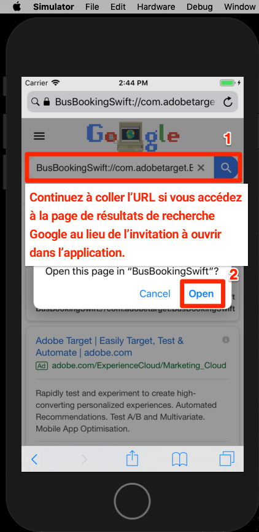

# Ajout du compositeur d’expérience visuelle (VEC) d’Adobe Target

Dans cette leçon, vous allez activer le compositeur d’expérience visuelle Target (VEC) pour les applications mobiles.

[Adobe Target](https://docs.adobe.com/content/help/en/target/using/target-home.html) est la solution Adobe Experience Cloud qui fournit tout ce dont vous avez besoin pour personnaliser l’expérience de vos clients, afin que vous puissiez optimiser les recettes sur vos sites Web et mobiles, vos applications, vos médias sociaux et d’autres canaux numériques.

L’application Visual Experience Composer (VEC) pour applications mobiles natives vous permet de créer des activités et de personnaliser du contenu sur les applications mobiles natives à votre propre manière sans dépendances de développement continu et de cycles de commercialisation d’application.

Dans la leçon [Ajouter des extensions](launch-add-extensions.md), vous avez ajouté l’extension Target VEC à votre propriété Launch. Dans la leçon [Installer le SDK](launch-install-the-mobile-sdk.md) mobile, vous avez importé l’extension dans l’exemple d’application. Seules quelques mises à jour mineures sont requises pour démarrer la configuration des activités dans le compositeur d’expérience visuelle mobile de Target !

>[!WARNING] Les extensions de lancement du compositeur d’expérience visuelle Target et Target sont requises pour utiliser le compositeur d’expérience visuelle Target dans votre application mobile.

## Objectifs d’apprentissage

À la fin de ce tutoriel, vous serez en mesure :

* Activation de l’exemple d’application pour le compositeur d’expérience visuelle Target
* Ajout de paramètres à la requête Target VEC
* Association de votre périphérique au compositeur d’expérience visuelle
* Création d’une activité à l’aide du compositeur d’expérience visuelle

## Conditions préalables 

Pour terminer les leçons de cette section, vous devez :

* Suivez les leçons des sections [Configuration du lancement](launch-create-a-property.md) .
* Disposer d’un accès de niveau approbateur à l’interface d’Adobe Target

## Ajouter des paramètres

Les mesures de cycle de vie sont automatiquement incluses en tant que paramètres dans la requête du compositeur d’expérience visuelle Target. Vous pouvez également ajouter des paramètres personnalisés aux requêtes.

**Pour ajouter des paramètres personnalisés**

1. Dans Xcode, ouvrez le `BookingViewController.swift` fichier. Ce fichier est utilisé par l’écran d’accueil.
1. Importer les extensions du compositeur d’expérience visuelle Target et Target sous les importations existantes

   ```swift
   import ACPTarget
   import ACPTargetVEC
   ```

1. Dans la `viewDidLoad()` fonction, après la ligne avec `super.viewDidLoad()` ajoutez le code suivant. Cet exemple de code montre comment ajouter des paramètres, des paramètres de profil, des paramètres de produit (ou d’entité) et des paramètres de commande à la requête TargetVEC. Cet exemple utilise des valeurs statiques, tandis que dans votre application réelle, vous souhaitez utiliser des variables dynamiques pour renseigner ces valeurs. Et bien sûr, vous ne voudriez que renseigner les paramètres liés à la vue :

   ```swift
   let params = ["param1":"value1"]
   let profileParams = ["profilekey1":"profilevalue1"]
   let product : ACPTargetProduct = ACPTargetProduct.init(id: "1234", categoryId: "furniture")
   let order : ACPTargetOrder = ACPTargetOrder.init(id: "12345", total: 123.45, purchasedProductIds: ["100", "200"])
   let targetParams : ACPTargetParameters = ACPTargetParameters.init(parameters: params, profileParameters: profileParams, product: product, order: order)
   ACPTargetVEC.setGlobalRequest(targetParams)
   ```

   

Maintenant que vous avez ajouté des paramètres à l’application, il est temps de confirmer qu’ils sont transmis dans la requête.

**Pour vérifier les paramètres**

1. Enregistrement du projet Xcode
1. Recréez l’application et attendez qu’elle soit rouverte dans le simulateur.
1. Cliquez dans le volet Console de Xcode.
1. Utiliser l’instruction de recherche
1. Rechercher `targetvec` dans la zone Rechercher
1. Accès `Enter` pour accéder à la requête Target et au corps de publication. Recherchez les paramètres personnalisés que vous venez d’ajouter à la requête :

   

## Association de l’application mobile à l’interface Target

Pour créer des activités du compositeur d’expérience visuelle dans l’interface de Target, vous devez d’abord associer Target à votre application. Ce couplage est réalisé avec l'utilisation de liens profonds.

### Création du schéma de lien profond

iOS prend en charge l’utilisation de liens [](https://developer.apple.com/documentation/uikit/core_app/allowing_apps_and_websites_to_link_to_your_content) universels et de schémas [d’URL](https://developer.apple.com/documentation/uikit/core_app/allowing_apps_and_websites_to_link_to_your_content/defining_a_custom_url_scheme_for_your_app) personnalisés pour créer des liens profonds vers votre application. Vous utilisez probablement déjà des schémas d’URL personnalisés dans votre application. Si tel est le cas, vous pouvez utiliser ces liens existants pour établir une paire avec Target. Pour ce didacticiel, vous devez créer un modèle d’URL personnalisé.

**Pour enregistrer votre schéma d’URL**

1. Dans Xcode, double-cliquez sur votre application pour ouvrir l’écran Paramètres.
1. Dans l’écran Paramètres, cliquez sur l’ `Info` onglet
1. Expand the `URL Types` section
1. Notez que l’ **[!UICONTROL identifiant]** est défini sur `com.adobetarget.BusBookingSwift`. Vous pouvez utiliser cet identifiant ou le modifier si vous le souhaitez.
1. Notez que le schéma **** d’URL est `BusBookingSwift`. Vous pouvez utiliser ce schéma ou le modifier si vous le souhaitez.
1. Assurez-vous que **[!UICONTROL Role]** est défini sur **[!UICONTROL Editor]**

   

1. Si vous avez mis à jour l'identifiant ou le schéma, cliquez sur l' `General` onglet pour enregistrer le schéma.  Cliquez sur Retour sur l' `Info` onglet, développez la `URL type` section et vérifiez que votre identifiant ou votre schéma est enregistré.

L’étape suivante consiste à ajouter un gestionnaire au lien profond.

**Pour gérer les liens profonds**

1. Ouvrir le `AppDelegate.swift` fichier
1. Ajoutez la ligne `ACPCore.collectLaunchInfo(["adb_deeplink": url.absoluteString])` à la `AppDelegate:application:openURL` section comme illustré ci-dessous.
   

### Vérifier le lien profond

Désormais, lorsqu’un utilisateur avec votre application installée ouvre une URL telle `BusBookingSwift://com.adobetarget.BusBookingSwift` (ou tout schéma que vous avez défini) dans le simulateur, il ouvre votre application.

**Pour vérifier le schéma des liens profonds**

1. Enregistrement du projet Xcode
1. Recréer l’application
1. Dans le simulateur, ouvrez Safari.
1. Entrez l'URL `BusBookingSwift://com.adobetarget.BusBookingSwift` (ou le schéma que vous avez défini) dans la barre d'adresse. Si vous avez des difficultés, consultez la section Conseil ci-dessous.
1. Vous devriez être invité à indiquer un mode "Ouvrir cette page dans "BusBookingSwift". Si vous avez des difficultés, consultez la section Conseil ci-dessous.
1. Cliquez sur `Open`
1. Cela devrait ouvrir l'application de réservation de bus

   > [!TIP] Si vous échouez lorsque vous copiez et collez l’URL de votre Bureau vers le simulateur, c’est généralement pour l’une des deux raisons suivantes :
   >
   >   1. **L’URL copiée à partir de l’interface Target ne se colle pas dans le simulateur** . Cela se produit lorsque les Presse-papiers Desktop et Simulator ne sont pas synchronisés.  Si cela se produit, essayez de désactiver et d’activer le `Automatically Sync Pasteboard` paramètre dans le simulateur et copiez/collez à nouveau :
      >
      >      
      
      >
      >   
   1. **Coller l’URL renvoie sur la page** de résultats de Google Search Essayez de recoller l’URL du lien profond dans la barre d’adresse et d’appuyer sur `Enter`. Vous devrez peut-être répéter cela quelques fois.


   

Maintenant que votre structure de liens profonds est configurée, vous êtes prêt à utiliser le compositeur d’expérience visuelle Target pour configurer des activités !

## Création d’une activité dans le compositeur d’expérience visuelle mobile

Créons maintenant une activité dans l’interface utilisateur de Target.

**Pour créer une activité avec le compositeur d’expérience visuelle de Target**

1. Connexion à [Adobe Experience Cloud](https://experiencecloud.adobe.com)
1. Utiliser le sélecteur de solution pour accéder à Target

   

1. Lancer Target

   

1. Cliquez sur le bouton **[!UICONTROL Créer l’activité]** et sélectionnez Test **[!UICONTROL A/B.]**
1. Sélectionner une application **[!UICONTROL mobile]**
1. Assurez-vous que **[!UICONTROL Visual]** est sélectionné sous **[!UICONTROL Sélectionner un compositeur d’expérience.]**
1. Cliquez sur le bouton **[!UICONTROL Suivant]** .

   

1. Dans l’écran **[!UICONTROL Sélectionner une application à utiliser]** , cliquez sur **[!UICONTROL Ajouter une nouvelle application.]**

   

1. Entrez le modèle d'URL que vous venez de définir dans le champ **[!UICONTROL Entrer le modèle]** d'URL, par ex. `BusBookingSwift://com.adobetarget.BusBookingSwift`
1. Cliquez sur **[!UICONTROL Créer un lien profond]**

   

   >[!NOTE] Vous disposez de quelques options pour envoyer le lien profond vers l’application. Vous pouvez :
   >
   >   1. Envoyez le lien profond à une adresse électronique valide, puis ouvrez le lien avec une application de messagerie sur le périphérique.
   >   1. Prenez une photo du code QR de votre périphérique iOS (dans notre didacticiel, le périphérique doit être lié à Xcode).
   >   1. Copiez le lien profond de l’interface Target et envoyez-le au périphérique comme vous le souhaitez.


1. Cliquez sur l'onglet **[!UICONTROL Copier et envoyer le lien]** .
1. Cliquez n’importe où sur le lien pour copier automatiquement le lien dans le Presse-papiers.

   

1. Revenir au simulateur
1. Ouvrir Safari dans le simulateur
1. Collez l’URL du lien profond dans la barre d’adresse.
1. Cliquez sur le `Open` bouton pour ouvrir l’application.

   > [!TIP] Si vous échouez lorsque vous copiez et collez l’URL de votre Bureau vers le simulateur, c’est généralement pour l’une des deux raisons suivantes :
   >
   >   1. **L’URL copiée à partir de l’interface Target ne se colle pas dans le simulateur** . Cela se produit lorsque les Presse-papiers Desktop et Simulator ne sont pas synchronisés.  Si cela se produit, essayez de désactiver et d’activer le `Automatically Sync Pasteboard` paramètre dans le simulateur et copiez/collez à nouveau :
      >
      >      
      
      >
      >   
   1. **Coller l’URL renvoie sur la page** de résultats de Google Search Essayez de recoller l’URL du lien profond dans la barre d’adresse et d’appuyer sur `Enter`. Vous devrez peut-être répéter cela quelques fois.


   

1. Une fois l’application chargée, revenez à l’onglet du navigateur dans lequel Target est ouvert. Votre application doit être chargée dans le compositeur d’expérience visuelle.
1. Cliquez sur des fichiers de texte et d’image dans votre application et vous devriez voir des options pour les modifier et les remplacer !

   

1. Apportez quelques modifications au premier écran de votre application.
1. Positionnez maintenant le simulateur en regard du navigateur avec le compositeur d’expérience visuelle ouvert.
1. Accédez à un autre écran de l’application et remarquez la mise à jour du compositeur d’expérience visuelle avec le simulateur !
1. Vous pouvez mettre à jour plusieurs vues dans votre application, dans une seule activité !
   
1. Vous pouvez également ajouter visuellement des mesures de suivi des clics !
1. Enregistrez et approuvez votre activité et vérifiez que vous pouvez l’afficher dans l’exemple d’application.

L’association du périphérique au compositeur d’expérience visuelle est une action unique. Lorsque vous créez d’autres activités dans le futur sur le même périphérique, vous pourrez simplement sélectionner le périphérique dans une liste, comme illustré ci-dessous :


>[!TIP] Si un périphérique est ouvert, mais qu’il est "Non disponible" dans le menu de sélection, mettez l’application en arrière-plan en revenant à l’écran d’accueil, puis déplacez l’application au premier plan pour la rendre "Disponible" à nouveau.

## Création d’audiences sur la base de mesures de cycle de vie

Mesures de cycle de vie intégrées relatives à l’utilisation par le visiteur de votre application, qui sont automatiquement incluses dans les appels effectués par le SDK mobile Adobe. Vous pouvez facilement créer des audiences dans Target en fonction de ces mesures.

**Pour créer une audience**

1. Dans l’interface Target, cliquez sur **Audiences** dans le volet de navigation supérieur.
1. Click the **Create Audience** button

   

1. Name the Audience `Launches < 5`
1. Click **Add Rule &gt; Custom**

   

1. Dans la première liste déroulante, sélectionnez le paramètre **a.Launches** . Tous les paramètres de mesure de cycle de vie commencent par "a".préfixe. Nous allons cibler le contenu en fonction du nombre de lancements d’application dont dispose l’utilisateur, ce qui constitue un excellent moyen de cibler les utilisateurs de votre application pour la première fois avec une expérience pédagogique, FTUE (First-user-experience).
1. Dans la liste déroulante suivante, sélectionnez **est inférieur à**
1. Dans la troisième liste déroulante, saisissez **5**
1. Cliquez sur **Enregistrer**

   

Notez qu’il existe une grande variété d’options prêtes à l’emploi pour la création d’audiences dans Target. De plus, vous pouvez envoyer des données personnalisées dans la demande Target pour la création d’audiences, utiliser des audiences partagées à partir d’autres solutions Experience Cloud, telles qu’Audience Manager et Analytics, et des données de gestion de la relation client partagées à Target à l’aide de la fonction Attributs du client du service principal People.

[Suivant : "Ajouter Adobe Target" &gt;](target.md)