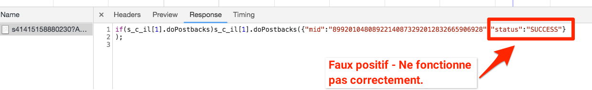

# Ajouter Adobe Audience Manager

Cette leçon vous guidera tout au long des étapes pour activer Adobe Audience Manager à l’aide du transfert côté serveur.

[Adobe Audience Manager](https://docs.adobe.com/content/help/en/audience-manager/user-guide/aam-home.html) (AAM) fournit des services de pointe en matière de gestion des données d’audience en ligne, offrant aux publicitaires et aux éditeurs numériques les outils dont ils ont besoin pour contrôler et exploiter leurs ressources de données afin de contribuer au succès des ventes.

## Objectifs d’apprentissage

À la fin de ce tutoriel, vous serez en mesure :

1. Décrivez les deux principales manières d’implémenter Audience Manager sur un site Web.
1. Ajout d’Audience Manager à l’aide du transfert côté serveur de la balise Analytics
1. Validation de l’implémentation d’Audience Manager

## Conditions préalables 

Pour terminer cette leçon, vous devez :

1. Pour suivre les leçons de [Configuration du lancement](launch.md), [ajoutez Adobe Analytics](analytics.md)et [ajoutez le service](id-service.md)d’identité.

1. Admin de l’accès à Adobe Analytics afin que vous puissiez activer le transfert côté serveur pour la suite de rapports que vous utilisez pour ce didacticiel. Vous pouvez également demander à un administrateur existant de votre organisation de le faire à votre place, en suivant les instructions ci-dessous.

1. Votre "sous-domaine Audience Manager" (également appelé "Nom du partenaire" "ID du partenaire" ou "Sous-domaine du partenaire"). Si Audience Manager est déjà mis en oeuvre sur votre site Web réel, le moyen le plus simple d’obtenir ce dernier est d’accéder à votre site Web réel et d’ouvrir le débogueur. Le sous-domaine est disponible dans l’onglet Résumé, dans la section Audience Manager :

   

Si vous n’avez pas encore mis en oeuvre Audience Manager, suivez ces instructions pour [obtenir votre sous-domaine](https://docs.adobe.com/content/help/en/audience-manager-learn/tutorials/web-implementation/how-to-identify-your-partner-id-or-subdomain.html)Audience Manager.

## Options d’implémentation

Il existe deux manières d’implémenter Audience Manager dans un site Web :

* **Transfert côté serveur (SSF)**: pour les clients qui utilisent Adobe Analytics, il s’agit de la méthode de mise en oeuvre la plus simple et la plus recommandée. Adobe Analytics transfère les données vers AAM sur le serveur principal d’Adobe, ce qui permet d’envoyer une requête en moins sur la page. Cela permet également d’intégrer des fonctionnalités clés et est conforme à nos meilleures pratiques pour l’implémentation et le déploiement du code Audience Manager.

* **DIL** côté client : cette approche est destinée aux clients qui ne disposent pas d’Adobe Analytics. Le code DIL (Code de la bibliothèque d’intégration de données, code de configuration JavaScript AAM) envoie directement les données de la page Web dans Audience Manager.

Comme vous avez déjà déployé Adobe Analytics dans ce didacticiel, vous allez déployer Audience Manager à l’aide du transfert côté serveur. For a complete description and requirements list for Server-Side forwarding, please review the [documentation](https://docs.adobe.com/content/help/en/analytics/admin/admin-tools/server-side-forwarding/ssf.html), so that you are familiar with how it works, what is required, and how to validate.

## Activer le transfert côté serveur

Deux étapes principales permettent d’effectuer une implémentation SSF :

1. Activez un "commutateur" dans la console d’administration Analytics pour transférer les données d’Analytics vers Audience Manager *par suite* de rapports.
1. Mise en place du code, effectuée par le biais du lancement. Pour que cela fonctionne correctement, vous devez avoir installé l’extension Adobe Experience Platform Identity Service, ainsi que l’extension Analytics (vous *n’aurez pas* besoin de l’extension AAM, comme expliqué ci-dessous).

### Activer le transfert côté serveur dans l’Admin Console Analytics

Une configuration dans la console d’administration Adobe Analytics est requise pour commencer à transférer des données d’Adobe Analytics vers Adobe Audience Manager. Comme il peut s’écouler jusqu’à quatre heures avant de commencer à transférer les données, vous devez d’abord effectuer cette étape.

#### Pour activer SSF dans la console d’administration Analytics

1. Connectez-vous à Analytics via l’interface utilisateur d’Experience Cloud. Si vous n’avez pas accès à Analytics par l’administrateur, contactez votre administrateur Experience Cloud ou Analytics pour vous y affecter ou suivez ces étapes.

   

1. Dans le volet de navigation supérieur d’Analytics, choisissez **[!UICONTROL Admin &gt; Report Suites]**, puis, dans la liste, sélectionnez (à sélection multiple) la ou les suites de rapports à transférer vers Audience Manager.

   

1. Dans l’écran Report Suites et avec les suites de rapports sélectionnées, choisissez **[!UICONTROL Modifier les paramètres &gt; Général &gt; Transfert côté serveur]**.

   

   >[!WARNING] Comme indiqué ci-dessus, vous devez disposer de droits d’administrateur pour afficher cet élément de menu.

1. Une fois sur la page Transfert côté serveur, lisez les informations et cochez la case **[!UICONTROL Activer le transfert]** côté serveur pour les suites de rapports.

1. Cliquez sur **[!UICONTROL Enregistrer]**

   

>[!NOTE] Puisque le SSF doit être activé par suite de rapports, n’oubliez pas de répéter cette étape pour vos suites de rapports réelles lorsque vous déployez le SSF sur la suite de rapports de votre site.
>
>En outre, si l’option SSF est grisée, vous devrez "mapper les suites de rapports avec votre organisation Experience Cloud pour activer cette option. Cela est expliqué dans [la documentation](https://docs.adobe.com/content/help/en/core-services/interface/about-core-services/report-suite-mapping.html).

Une fois cette étape terminée et si le service d’identité de la plate-forme Adobe Experience Platform est activé, les données sont transférées d’Analytics vers AAM. Toutefois, pour terminer le processus de sorte que la réponse revienne correctement d’AAM à la page (ainsi qu’à Analytics via la fonctionnalité Analyses d’audience), vous devez également exécuter l’étape suivante dans Lancement. Ne vous en faites pas, c'est super facile.

### Activer le transfert côté serveur dans Launch

Il s'agit de la deuxième étape de l'activation de la fonction SSF. Vous avez déjà inversé le commutateur dans la console d’administration Analytics et vous devez maintenant ajouter le code, ce que le lancement fera pour vous si vous cochez simplement la case appropriée.

>[!NOTE] Pour implémenter le transfert côté serveur des données Analytics dans AAM, nous allons modifier/configurer l’extension Analytics dans Launch, **pas** l’extension AAM. L’extension AAM est utilisée exclusivement pour les implémentations DIL côté client, pour les personnes qui ne disposent pas d’Adobe Analytics. Les étapes suivantes sont donc correctes lorsqu’elles vous envoient dans l’extension Analytics pour configurer cette opération.

#### Pour activer SSF au lancement

1. Accédez à **[!UICONTROL Extensions &gt; Installées]** et cliquez sur pour configurer l’extension Analytics.

   

1. Expand the `Adobe Audience Manager` section

1. Cochez la case pour partager **[!UICONTROL automatiquement les données Analytics avec Audience Manager]**. Cette opération ajoute le "module" d’Audience Manager (code) à la `AppMeasurement.js` mise en oeuvre d’Analytics.

1. Ajoutez votre "sous-domaine Audience Manager" (également appelé "Nom du partenaire", "ID du partenaire" ou "Sous-domaine du partenaire"). Suivez ces instructions pour [obtenir votre sous-domaine](https://docs.adobe.com/content/help/en/audience-manager-learn/tutorials/web-implementation/how-to-identify-your-partner-id-or-subdomain.html)Audience Manager.

1. Cliquez sur **[!UICONTROL Enregistrer dans la bibliothèque et Créer.]**

   

Le code de transfert côté serveur est maintenant implémenté !

### Valider le transfert côté serveur

Le principal moyen de valider le transfert côté serveur est de consulter la réponse à l’un de vos accès Adobe Analytics. Nous y parviendrons dans une minute. En attendant, regardons quelques autres choses qui peuvent nous aider à nous assurer que ça marche comme nous le voulons.

#### Vérification du chargement correct du code

Le code qu’Adobe Launch installe pour gérer le transfert, et en particulier la réponse d’AAM à la page, s’appelle le "Module" d’Audience Manager. Nous pouvons utiliser le débogueur Experience Cloud pour nous assurer qu’il a été chargé.

1. Ouverture du site Luma
1. Cliquez sur l’icône de débogueur dans votre navigateur pour ouvrir le débogueur Experience Cloud.
1. Dans l’onglet Résumé, faites défiler l’écran jusqu’à la section Analytics.
1. Verify that **AudienceManagement** is listed under the Modules section

   

#### Vérifier l’identifiant de partenaire dans le débogueur

Ensuite, nous pouvons également vérifier que le débogueur sélectionne le bon "ID de partenaire" (sous-domaine du partenaire AKA, etc.) du code.

1. Toujours dans le débogueur et toujours dans l’onglet Résumé, faites défiler l’écran jusqu’à la section Gestionnaire de publics.
1. Vérifiez votre ID de partenaire/sous-domaine sous "Partenaire".

   

>[!WARNING] Vous remarquerez peut-être que la section Audience Manager du débogueur fait référence à "DIL", qui est la "bibliothèque d’intégration des données", et fait généralement référence à une implémentation côté client, par opposition à l’approche côté serveur que nous avons implémentée ici. La vérité est que le "module" AAM (utilisé dans cette approche SSF) utilise beaucoup du même code que la bibliothèque DIL côté client. C’est pourquoi ce débogueur le signale en tant que tel. Si vous avez suivi les étapes de ce didacticiel et que les autres éléments de cette section de validation sont corrects, vous êtes assuré que le transfert côté serveur fonctionne.

#### Vérification de la requête et de la réponse Analytics

OK, c'est le plus important. Si vous n’effectuez pas de transfert côté serveur des données d’Analytics vers Audience Manager, il n’existe vraiment aucune réponse à la balise Analytics (en dehors d’un pixel de 2x2). Toutefois, si vous effectuez une SSF, vous pouvez vérifier certains éléments dans la requête et la réponse Analytics afin de vous informer qu’elle fonctionne correctement.
Malheureusement, pour le moment, le débogueur d’Experience Cloud ne prend pas en charge l’affichage de la réponse aux balises. Par conséquent, vous devez utiliser un autre débogueur/renifleur de paquets, comme Charles Proxy ou les Outils de développement du navigateur.

1. Ouvrez les outils de développement dans votre navigateur et accédez à l’onglet Réseau.
1. Dans le champ de filtre, tapez `b/ss` qui limitera ce que vous voyez aux requêtes Adobe Analytics.
1. Actualiser la page pour afficher la demande Analytics

   

1. Dans la balise Analytics (requête), recherchez un paramètre de rappel. Il sera défini sur quelque chose comme ceci : `s_c_il[1].doPostbacks`

   

1. Vous obtiendrez une réponse à la balise Analytics. Il contiendra des références à doPostbacks, comme appelé dans la requête, et surtout, il doit avoir un objet "stuff". C’est là que les ID de segment AAM seront renvoyés au navigateur. Si vous avez l'objet "machin", SSF fonctionne !

   

>[!WARNING] Attention au faux "Succès" - S'il y a une réponse, et que tout semble marcher, **assurez** -vous que vous avez cet objet "truc". Si vous ne le faites pas, vous verrez peut-être un message dans la réponse qui indique "status":"SUCCESS". Aussi fou que cela puisse paraître, c'est en fait la preuve qu'il **ne fonctionne pas** correctement. Si vous voyez cela, cela signifie que vous avez terminé cette deuxième étape (le code dans Lancement), mais que le transfert dans la console d’administration Analytics (première étape de cette section) n’est pas encore terminé. Dans ce cas, vous devez vérifier que vous avez activé SSF dans la console d’administration Analytics. Si vous l'avez fait, et ça n'a pas encore été 4 heures, soyez patient.

[Prochaine "Intégrations Experience Cloud" &gt;](integrations.md)