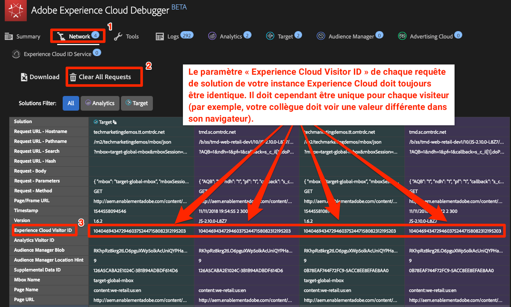
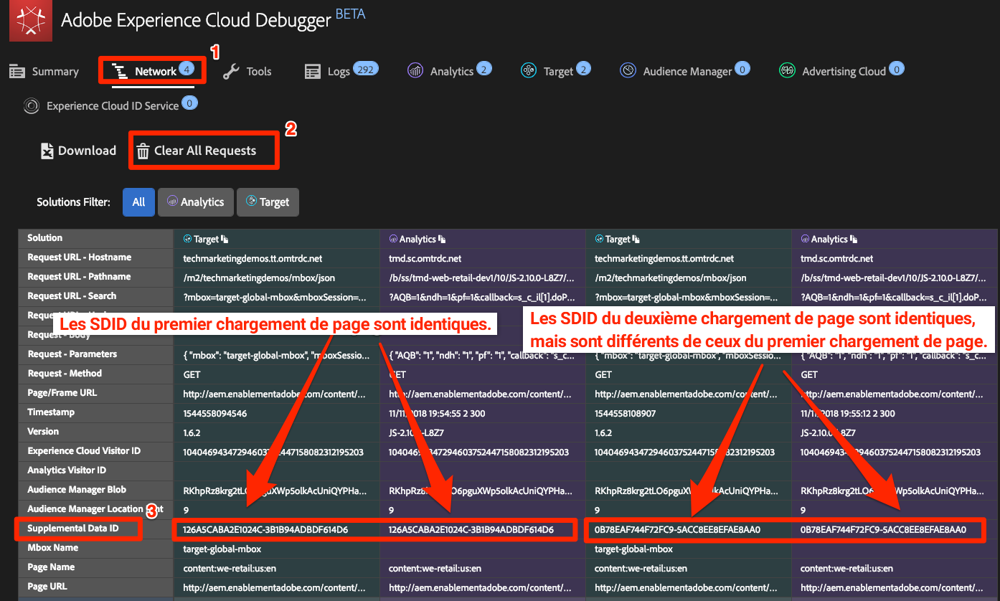
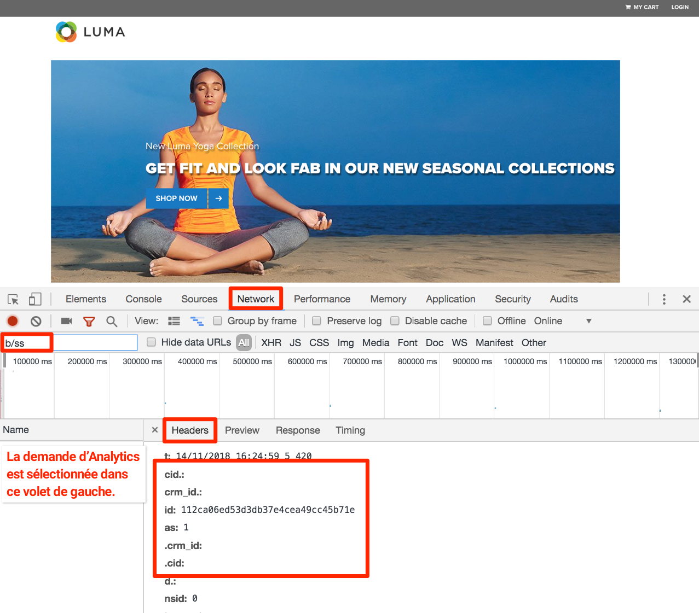

# Intégrations Experience Cloud

Dans cette leçon, vous examinerez les principales intégrations entre les solutions que vous venez d’implémenter. La bonne nouvelle, c'est qu'en complétant les leçons précédentes, vous avez déjà mis en oeuvre les aspects code des intégrations ! Vous n’avez pas besoin de faire de travail supplémentaire dans cette leçon, outre la lecture et la validation.

## Objectifs d’apprentissage

À la fin de ce tutoriel, vous serez en mesure :

1. Expliquer les cas d’utilisation de base pour le partage d’audience, Analytics pour Target (A4T) et les intégrations des attributs du client
1. Valider les aspects de base de la mise en œuvre de ces intégrations côté client

## Conditions préalables

Vous devez suivre toutes les leçons précédentes de ce didacticiel avant de suivre les instructions de cette leçon.

>[!NOTE] Il existe de nombreuses exigences d’autorisation des utilisateurs, ainsi que des étapes de configurations de compte et d’attribution des privilèges d’accès requises pour utiliser pleinement ces intégrations et qui vont au-delà de ce tutoriel. Si vous n’utilisez pas déjà ces intégrations dans votre implémentation actuelle d’Experience Cloud, tenez compte des points suivants :
>
> * Examinez toutes les exigences relatives aux [intégrations des services principaux](https://docs.adobe.com/content/help/en/core-services/interface/about-core-services/core-services.html).
> * Examinez toutes les exigences relatives à l’[intégration Analytics for Target](https://docs.adobe.com/content/help/en/target/using/integrate/a4t/before-implement.html).
> * Have an Administrator of your Experience Cloud Organization [request provisioning of these integrations](https://www.adobe.com/go/audiences)

## Audiences

[Les audiences](https://docs.adobe.com/content/help/en/core-services/interface/audiences/audience-library.htm) font partie du service principal People et vous permettent de partager des audiences entre différentes solutions. Par exemple, vous pouvez créer une audience dans Audience Manager et l’utiliser pour diffuser du contenu personnalisé avec Target.

Les principales exigences pour la mise en oeuvre d’A4T (ce que vous avez déjà fait) sont les suivantes :

1. Mise en oeuvre d’Adobe Experience Platform Identity Service
1. Mise en oeuvre d’Audience Manager
1. Mettez en oeuvre d’autres solutions que vous souhaitez recevoir ou créer des audiences, telles que Target et Analytics.

### Validation de l’intégration des audiences

La meilleure façon de valider l’intégration des audiences consiste à créer une audience, à la partager dans une autre solution, puis à l’utiliser pleinement dans l’autre solution (par exemple, confirmez qu’un visiteur qui est admissible pour un segment AAM peut être admissible pour une activité Target ciblée sur ce segment). Toutefois, cela va au-delà de la portée de ce tutoriel.

Ces étapes de validation se concentrent sur la partie critique visible dans l’implémentation côté client, à savoir l’identifiant visiteur.

1. Open the [Luma site](https://luma.enablementadobe.com/content/luma/us/en.html)

1. Make sure the Debugger is mapping the Launch property to *your* Development environment, as described in the [earlier lesson](launch-switch-environments.md)

   

1. Accédez à l’onglet Réseau du débogueur

1. Cliquez sur **[!UICONTROL Effacer toutes les requêtes]** uniquement pour nettoyer les éléments

1. Rechargez la page Luma, en vous assurant que vous voyez les requêtes Target et Analytics dans le débogueur

1. Recharger la page Luma

1. Vous devriez maintenant voir quatre requêtes dans l’onglet Réseau du débogueur : deux pour Target et deux pour Analytics.

1. Recherchez dans la ligne intitulée "Identifiant visiteur Experience Cloud". Les ID de chaque requête pour chaque solution doivent toujours être identiques.

   

1. Les ID sont propres à chaque visiteur, ce que vous pouvez vérifier en demandant à un collègue de répéter ces étapes.

## Analytics for Target (A4T)

The [Analytics for Target (A4T)](https://docs.adobe.com/content/help/en/target/using/integrate/a4t/a4t.html) integration allows you to leverage your Analytics data as the source for reporting metrics in Target.

Les principales exigences pour la mise en oeuvre d’A4T (ce que vous avez déjà fait) sont les suivantes :

1. Mise en oeuvre d’Adobe Experience Platform Identity Service
1. Déclenchez la demande de chargement de page Target avant la balise d’affichage de page Analytics.

A4T fonctionne en assemblant une requête côté serveur de Target à Analytics avec la balise de page vue Analytics, que nous appelons "raccordement d’accès".  L’assemblage d’accès requiert que la requête Target qui livre l’activité (ou incrémente une mesure d’objectif basée sur Target) ait un paramètre qui correspond à un paramètre dans la balise de page vue Analytics. Ce paramètre est appelé SDID (Supplemental data id).

### Valider la mise en œuvre d’A4T

Le meilleur moyen de valider l’intégration A4T est de créer une activité Target à l’aide d’A4T et de valider les données de création de rapports. Toutefois, cela dépasse la portée de ce didacticiel. Ce didacticiel vous montre comment confirmer que les identifiants de données supplémentaires correspondent entre les appels de solution.

**Pour valider les SDID**

1. Open the [Luma site](https://luma.enablementadobe.com/content/luma/us/en.html)

1. Make sure the Debugger is mapping the Launch property to *your* Development environment, as described in the [earlier lesson](launch-switch-environments.md)

   

1. Accédez à l’onglet Réseau du débogueur

1. Cliquez sur **[!UICONTROL Effacer toutes les requêtes]** uniquement pour nettoyer les éléments

1. Rechargez la page Luma, en vous assurant que vous voyez les requêtes Target et Analytics dans le débogueur

1. Recharger la page Luma

1. Vous devriez maintenant voir quatre requêtes dans l’onglet Réseau du débogueur : deux pour Target et deux pour Analytics.

1. Regardez dans la ligne intitulée « Supplemental Data ID » (ID de données supplémentaire). Les ID du premier chargement de page doivent correspondre entre Target et Analytics. Les identifiants du second chargement de page doivent également correspondre, mais être différents par rapport au premier chargement de page.

   

Si vous effectuez d’autres requêtes Target dans l’étendue d’un chargement de page (à l’exclusion des applications d’une seule page) qui font partie des activités A4T, il est recommandé de leur attribuer des noms uniques (et non des mbox-globale-cible) afin qu’elles continuent d’avoir les mêmes SDID que les requêtes Target et Analytics initiales.

## Attributs du client

[Les attributs](https://docs.adobe.com/content/help/en/core-services/interface/customer-attributes/attributes.html) du client font partie du service principal People qui vous permet de télécharger des données de votre base de données de gestion de la relation client (CRM) et de les exploiter dans Adobe Analytics et Adobe Target.

Les principales conditions requises pour implémenter les attributs du client (ce que vous avez déjà fait) sont les suivantes :

1. Mise en oeuvre d’Adobe Experience Platform Identity Service
1. Set Customer Ids via the Id Service *before* Target and Analytics fire their requests (which you accomplished using the rule ordering feature in Launch)

### Validation de l’implémentation des attributs du client

Vous avez déjà validé que les ID de client sont transmis au service d’identité et à Target dans les leçons précédentes. Vous pouvez également valider l’ID de client dans l’accès Analytics.
Actuellement, l’ID de client est l’un des rares paramètres qui ne s’affiche pas dans le débogueur d’Experience Cloud. Vous utiliserez donc la console JavaScript du navigateur pour l’afficher.

1. Ouverture du site Luma
1. Ouvrez les outils de développement de votre navigateur
1. Accéder à l’onglet Réseau
1. Dans le champ de filtre, tapez `b/ss` qui limitera ce que vous voyez aux requêtes Adobe Analytics.

   

1. Cliquez sur le lien **[!UICONTROL CONNEXION]** dans le coin supérieur droit du site.

   

1. Entrez `test@adobe.com` comme nom d'utilisateur
1. Entrez `test` le mot de passe
1. Cliquez sur le bouton **[!UICONTROL CONNEXION]** .

   

1. Il devrait vous renvoyer à la page d'accueil, qui déclenchera également une balise visible dans les outils de développement. Si vous êtes amené à la page d'information du compte, cliquez sur le logo WE.RETAIL pour retourner à la page d'accueil.
1. Cliquez sur la requête et sélectionnez l’onglet En-têtes.
1. Faites défiler l’écran vers le bas jusqu’à ce que certains paramètres imbriqués s’affichent.
   1. cid - il s’agit du délimiteur standard pour la partie ID client de la requête.
   1. crm_id - Il s'agit du code d'intégration personnalisé, que vous avez spécifié dans la leçon Service d'identité
   1. id - The Customer ID value coming from your `Email (Hashed)` data element
   1. as - État d’authentification, avec "1" signifiant connecté
   

[Suivant : "Publier votre propriété" &gt;](publish.md)