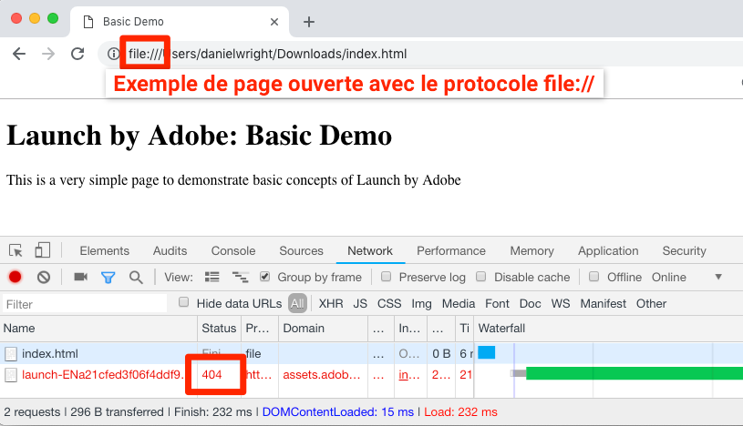

# Ajout du code incorporé Launch

Dans cette leçon, vous allez mettre en oeuvre le code incorporé asynchrone de l’environnement de développement de votre propriété Launch. En chemin, vous découvrirez deux concepts principaux de Launch : Environments et Embed Codes.

## Objectifs d’apprentissage

À la fin de ce tutoriel, vous serez en mesure :

* Obtenez le code incorporé de votre propriété Launch.
* Comprendre la différence entre environnement de développement, d’évaluation et de production
* Ajout d’un code incorporé de lancement à un document HTML
* Explain the optimal location of the Launch embed code in relation to other code in the `<head>` of an html document

## Copie du code incorporé

The embed code is a `<script>` tag that you put on your webpages to load and execute the logic you build in Launch. Si vous chargez la bibliothèque de manière asynchrone, le navigateur continue à charger la page, récupère la bibliothèque de lancement et l’exécute en parallèle. Dans ce cas, il n’y a qu’un seul code incorporé à placer dans l’élément `<head>`. (When Launch is deployed synchronously, there are two embed codes, one which you put in the `<head>` and another which you put before the `</body>`).

Dans l’écran Overview (Présentation) de la propriété, cliquez sur l’onglet `Environments` (Environnements) pour accéder à la page des environnements. Notez que les environnements de développement, de test et de production ont été précréés pour vous.


Les environnements de développement, d’évaluation et de production correspondent aux environnements typiques du processus de développement et de mise à jour du code. Le code est d’abord écrit par un développeur dans un environnement de développement. Lorsqu’ils ont terminé leur travail, les développeurs envoient le code à un environnement d’évaluation où il est révisé par des équipes d’assurance qualité et d’autres équipes. Une fois l’équipe d’assurance qualité et les autres équipes satisfaites, le code est ensuite publié dans l’environnement Production, qui est l’environnement public que vos visiteurs rencontrent lorsqu’ils se rendent sur votre site Web.

Le lancement permet d’autres environnements de développement, ce qui est utile dans les grandes entreprises où plusieurs développeurs travaillent simultanément sur différents projets.

Ce sont les seuls environnements dont nous avons besoin pour terminer le tutoriel. Les environnements vous permettent d’avoir différentes versions de travail de vos bibliothèques de lancement hébergées sur des URL différentes, afin que vous puissiez ajouter en toute sécurité de nouvelles fonctionnalités et les rendre accessibles aux utilisateurs appropriés (développeurs, ingénieurs de contrôle qualité, public, etc.). au bon moment.

Copions maintenant le code incorporé :

1. In the **[!UICONTROL Development]** row, click the Install icon  to open the modal.

1. Notez que Launch utilise par défaut les codes incorporés asynchrones.

1. Cliquez sur l’icône Copier  pour copier le code incorporé dans le Presse-papiers.

1. Click **[!UICONTROL Close]** to close the modal.

   

## Implement the Embed Code in the `<head>` of the Sample HTML Page

The embed code should be implemented in the `<head>` element of all HTML pages that will share the property. You might have one or several template files which control the `<head>` globally across the site, making it a straightforward process to add Launch.

Si ce n'est déjà fait, téléchargez [l'exemple de page](https://www.enablementadobe.com/multi/web/basic-sample.html) html (cliquez avec le bouton droit sur ce lien et cliquez sur "Enregistrer le lien sous") et ouvrez-le dans un éditeur de code. [Brackets](http://brackets.io/) est un éditeur libre et open source si vous en avez besoin.

Remplacez le code incorporé existant à la ligne 34 ou aux alentours par celui de votre presse-papiers et enregistrez la page. Ouvrez maintenant la page dans un navigateur Web. If you are loading the page using the `file://` protocol, you will need to add "https:" at the beginning of the embed code URL in your code editor). Les lignes 33 à 36 de votre page d’exemple devraient ressembler à ceci :

```html
    <!--Launch Header Embed Code: REPLACE LINE 39 WITH THE EMBED CODE FROM YOUR OWN DEVELOPMENT ENVIRONMENT-->
    <script src="https://assets.adobedtm.com/launch-ENa21cfed3f06f4ddf9690de8077b39e81-development.min.js" async></script>
    <!--/Launch Header Embed Code-->
```

Ouvrez les outils de développement de votre navigateur Web et accédez à l’onglet Réseau. At this point you should see a 404 error for the Launch environment URL:


L’erreur 404 est attendue car vous n’avez pas encore créé de bibliothèque dans cet environnement de lancement. Ce point sera abordé dans la leçon suivante. Si un message d’erreur « fail » s’affiche à la place d’une erreur 404, vous avez probablement oublié d’ajouter le protocole `https://` au code incorporé. Là encore, il suffit d’ajouter `https://` si vous chargez la page d’exemple à l’aide du protocole `file://`. Effectuez cette modification et rechargez la page jusqu’à ce que l’erreur 404 s’affiche.

## Meilleures pratiques de mise en oeuvre du lancement

Examinons quelques-unes des meilleures pratiques de mise en oeuvre du lancement, qui sont illustrées dans l’exemple de page :

* **Couche de données** :

   * We *strongly* recommend creating a digital data layer on your site containing all of the attributes needed to populate variables in Analytics, Target, and other marketing solutions. Cette page d’exemple ne contient qu’une couche de données très simple, mais une véritable couche de données peut contenir beaucoup plus de détails à propos de la page, du visiteur, des informations sur son panier, etc. For more info on data layers, please see [Customer Experience Digital Data Layer 1.0](https://www.w3.org/2013/12/ceddl-201312.pdf)

   * Définissez votre couche de données avant le code incorporé Lancer, afin d’optimiser ce que vous pouvez faire dans Target, les attributs du client et Analytics.

* **Bibliothèques** d’aide JavaScript : Si une bibliothèque telle que JQuery est déjà implémentée dans `<head>` vos pages, chargez-la avant le lancement afin d’utiliser sa syntaxe dans Launch et Target.

* **Doctype** HTML5 : Le type de document HTML5 est requis par Target

* **preconnect et dns-prefetch** : utilisez preconnect and dns-prefetch pour améliorer le temps de chargement de la page. Voir aussi : [https://w3c.github.io/resource-hints/](https://w3c.github.io/resource-hints/)

* **prémasquage du fragment de code pour les implémentations** asynchrones de Target : Vous en apprendrez plus à ce sujet dans la leçon Target, mais lorsque Target est déployé via des codes incorporés de lancement asynchrones, vous devez figer dans le code un fragment de code prémasqué sur vos pages avant les codes incorporés de lancement afin de gérer le scintillement du contenu.

Voici un résumé des bonnes pratiques décrites ci-dessus dans l’ordre conseillé. Notez qu’il existe des espaces réservés pour les détails spécifiques au compte :

```html
<!doctype html>
<html lang="en">
<head>
    <title>Basic Demo</title>
    <!--Preconnect and DNS-Prefetch to improve page load time. REPLACE "techmarketingdemos" WITH YOUR OWN AAM PARTNER ID, TARGET CLIENT CODE, AND ANALYTICS TRACKING SERVER-->
    <link rel="preconnect" href="//dpm.demdex.net">
    <link rel="preconnect" href="//fast.techmarketingdemos.demdex.net">
    <link rel="preconnect" href="//techmarketingdemos.demdex.net">
    <link rel="preconnect" href="//cm.everesttech.net">
    <link rel="preconnect" href="//techmarketingdemos.tt.omtrdc.net">
    <link rel="preconnect" href="//techmarketingdemos.sc.omtrdc.net">
    <link rel="dns-prefetch" href="//dpm.demdex.net">
    <link rel="dns-prefetch" href="//fast.techmarketingdemos.demdex.net">
    <link rel="dns-prefetch" href="//techmarketingdemos.demdex.net">
    <link rel="dns-prefetch" href="//cm.everesttech.net">
    <link rel="dns-prefetch" href="//techmarketingdemos.tt.omtrdc.net">
    <link rel="dns-prefetch" href="//techmarketingdemos.sc.omtrdc.net">
    <!--/Preconnect and DNS-Prefetch-->
    <!--Data Layer to enable rich data collection and targeting-->
    <script>
    var digitalData = {
        "page": {
            "pageInfo" : {
                "pageName": "Home"
                }
            }
    };
    </script>
    <!--/Data Layer-->
    <!--jQuery or other helper libraries-->
    <script src="https://code.jquery.com/jquery-3.3.1.min.js"></script>
    <!--/jQuery-->
    <!--prehiding snippet for Adobe Target with asynchronous Launch deployment-->
    <script>
        (function(g,b,d,f){(function(a,c,d){if(a){var e=b.createElement("style");e.id=c;e.innerHTML=d;a.appendChild(e)}})(b.getElementsByTagName("head")[0],"at-body-style",d);setTimeout(function(){var a=b.getElementsByTagName("head")[0];if(a){var c=b.getElementById("at-body-style");c&&a.removeChild(c)}},f)})(window,document,"body {opacity: 0 !important}",3E3);
    </script>
    <!--/prehiding snippet for Adobe Target with asynchronous Launch deployment-->
    <!--Launch Header Embed Code: REPLACE LINE 39 WITH THE INSTALL CODE FROM YOUR OWN DEVELOPMENT ENVIRONMENT-->
    <script src="//assets.adobedtm.com/launch-EN93497c30fdf0424eb678d5f4ffac66dc.min.js" async></script>
    <!--/Launch Header Embed Code-->
</head>
<body>
    <h1>Launch by Adobe: Basic Demo</h1>
    <p>This is a very simple page to demonstrate basic concepts of Launch by Adobe</p>
</body>
</html>
```

Vous savez maintenant comment ajouter le code d’intégration de lancement à votre site !

[Suivant : "Ajouter un élément de données, une règle et une bibliothèque" &gt;](launch-data-elements-rules.md)